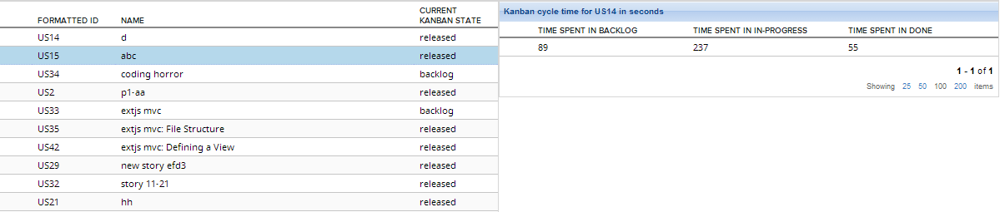

Cycle Tim-LookbackAPI example
=========================

## Overview

Single-click on the row in a grid to load cycle time for a selected story.

This app is available on AS IS basis. It is not supported by Rally support.
## License

AppTemplate is released under the MIT license.  See the file [LICENSE](./LICENSE) for the full text.

##Documentation for SDK

You can find the documentation on our help [site.](https://help.rallydev.com/apps/2.0rc2/doc/)
